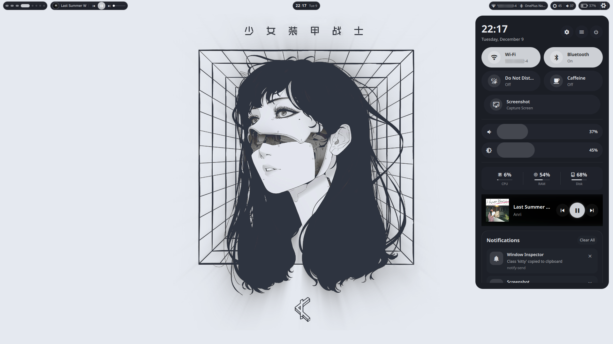
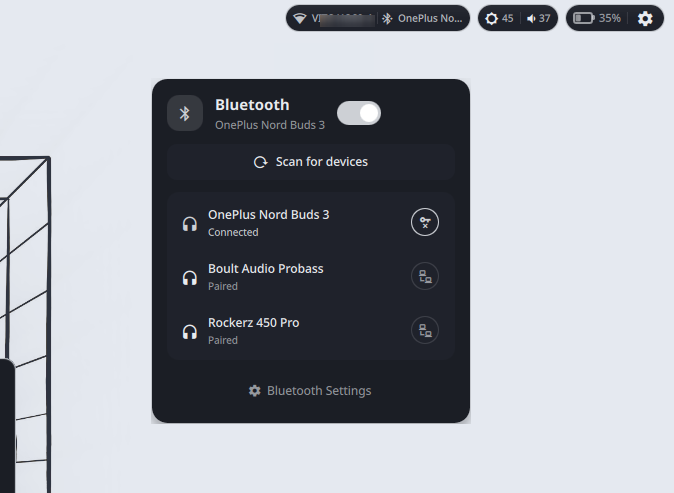
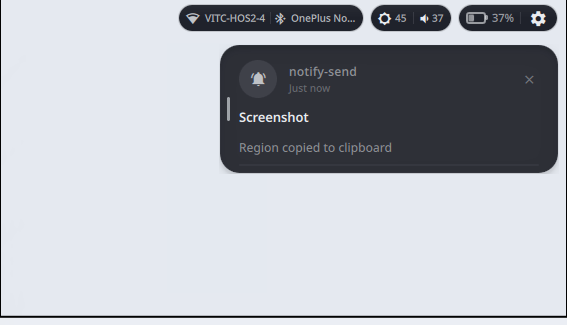

# 🐚 QuickShell Configuration


A highly customizable, modular, and performant desktop shell configuration built with [QuickShell](https://quickshell.org/) and QtQuick. Designed for Wayland compositors, with first-class support for **Hyprland**.

---

## ✨ Features

- **🎨 Dynamic Theming**: Seamless integration with `pywal` for wallpaper-based color schemes.
- **🧩 Modular Architecture**: Components are isolated and reusable, making customization easy.
- **🔔 Rich Notifications**: Full support for notification actions, images, and history.
- **🎛️ Control Center**: Quick access to system toggles (WiFi, Bluetooth, DND), audio, and brightness.
- **📊 System Monitoring**: Real-time stats for CPU, RAM, Battery, and Network usage.
- **✨ Smooth Animations**: Fluid, hardware-accelerated transitions and shader effects for a polished feel.
- **⌨️ OSD**: Clean On-Screen Display for volume and brightness changes.

## 🖼️ Gallery

> *Add your screenshots here*

| Desktop & Bar | Control Center | Notification Center |
|:-------------:|:--------------:|:-------------------:|
|  |  |  |
| *Clean desktop with bar and beautiful Control Center* | *quick toggles/popups for bluetooth and wifi with clean design* | *Grouped notifications* |

## 🛠️ Prerequisites

Before installing, ensure your system meets the following requirements:

### Core Dependencies
- **QuickShell** (v0.2+)
- **Qt 6** (Targeting Qt 6.10)
- **Hyprland** (Recommended compositor)

### System Services
| Service | Purpose |
|---------|---------|
| `pywal` | Color scheme generation |
| `pipewire` / `wireplumber` | Audio management |
| `networkmanager` | Network connectivity |
| `bluez` | Bluetooth stack |
| `upower` | Battery monitoring |
| `grim` & `slurp` | Screenshot functionality |
| `mpris` player | Media control (Spotify, mpv, etc.) |

## 🚀 Installation & Setup

### 1. Clone the Repository
Clone this configuration into your QuickShell config directory:

```bash
git clone https://github.com/yourusername/quickshell-config ~/.config/quickshell
cd ~/.config/quickshell
```

### 2. Automated Setup (Recommended)
We provide a setup script to install dependencies (Arch Linux) and configure your environment:

```bash
chmod +x setup.sh
./setup.sh
```

### 3. Manual Setup
If you prefer manual configuration or are not on Arch Linux:

1.  **Install Dependencies**: Install all packages listed in the [Prerequisites](#prerequisites) section.
2.  **Generate Colors**: Run `wal -i /path/to/wallpaper` to generate the initial color scheme.
3.  **Hyprland Config**: Add the following to your `~/.config/hypr/hyprland.conf` to fix layer shell animations:
    ```hyprlang
    source = ~/.config/quickshell/hyprland-layer-config.conf
    ```

## 🖥️ Usage

### Starting the Shell
To start QuickShell manually:
```bash
quickshell
```

To start it automatically with Hyprland, add this to your `hyprland.conf`:
```hyprlang
exec-once = quickshell
```

### Management Scripts
- **`./reload-quickshell.sh`**: Safely restarts the shell process. Use this after making config changes.
- **`./setup.sh`**: Checks for dependencies and configures the environment.

## 📂 Project Structure

```graphql
~/.config/quickshell/
├── 📁 assets/          # Icons, shaders, and static resources
├── 📁 components/      # Reusable UI elements (Buttons, Sliders)
├── 📁 config/          # Configuration files (Colors, Sizes, Behavior)
├── 📁 modules/         # Main UI widgets (Bar, Dashboard, OSD)
├── 📁 services/        # Backend logic (System integration)
├── 📜 shell.qml        # Entry point
└── 📜 setup.sh         # Installation helper
```

## 🔧 Troubleshooting

**Q: The shell looks unstyled or colors are missing.**
A: Ensure you have run `wal -i /path/to/image` at least once. The shell relies on `~/.cache/wal/colors.json`.

**Q: Animations are jerky or windows have weird borders.**
A: Make sure you have sourced `hyprland-layer-config.conf` in your Hyprland configuration.

**Q: Audio/Network controls aren't working.**
A: Verify that `pipewire`, `wireplumber`, and `networkmanager` services are running.

## 📄 License

This project is licensed under the MIT License - see the [LICENSE](LICENSE) file for details.
